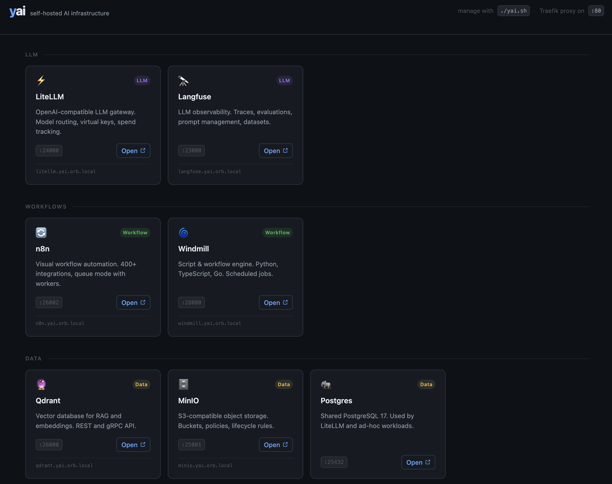

# Ynfra | yAI

[](https://www.youtube.com/watch?v=Dm7tMzakhuo)

A self-hosted docker-based AI infrastructure stack.
With LLM gateway, observability, vector DB, object storage, workflow engines, browser fleet, and a metrics/logs/traces backend.

---



<p align=center>
Website 🚀 <a href="https://f3l1x.io">f3l1x.io</a> | Contact 👨🏻‍💻 <a href="https://f3l1x.io">f3l1x.io</a> | Twitter 🐦 <a href="https://twitter.com/xf3l1x">@xf3l1x</a>
</p>

---

## Prerequisites

- [Docker Engine](https://docs.docker.com/engine/) ≥ 24 with [Compose v2](https://docs.docker.com/compose/).
- [OrbStack](https://orbstack.dev) (recommended for local development on macOS)

## Quick start

```bash
# 1. Create data directories and check for placeholder secrets
./yai.sh init all

# 2. Bring up the stack
./yai.sh stack start
```

## CLI

```
./yai.sh stack <cmd>              operate on every service
./yai.sh service <name> <cmd>     operate on one service
./yai.sh <cmd> [service|all]      short form

Commands: init | start | stop | restart | logs | ps | status | orbstack:install
```


## Services

| Service | URL | Port | Credentials |
|---|---|---|---|
| dashboard | <http://yai.orb.local> | — | no auth |
| litellm | <http://litellm.yai.orb.local/ui> | 24000 | `admin` / `litellm/.env.local` → `LITELLM_MASTER_KEY` |
| langfuse | <http://langfuse.yai.orb.local> | 23000 | sign up on first visit |
| grafana | <http://grafana.yai.orb.local> | 22000 | `admin` / `grafana/.env.local` → `GRAFANA_ADMIN_PASSWORD` |
| n8n | <http://n8n.yai.orb.local> | 26002 | create owner account on first visit |
| windmill | <http://windmill.yai.orb.local> | 28000 | `admin@windmill.dev` / `changeme` |
| firecrawl | <http://firecrawl.yai.orb.local> | 21000 | no auth |
| minio (console) | <http://minio.yai.orb.local> | 25001 | `minio/.env.local` → `MINIO_ROOT_USER` / `MINIO_ROOT_PASSWORD` |
| qdrant | <http://qdrant.yai.orb.local/dashboard> | 26000 | no auth |
| postgres | `yai.orb.local:25432` (TCP) | 25432 | user `yai`, DB `yai`, password in `postgres/.env.local` |
| vmetrics | <http://vmetrics.yai.orb.local> | 28428 | no auth |
| vlogs | <http://vlogs.yai.orb.local> | 29428 | no auth |
| vtraces | <http://vtraces.yai.orb.local> | 21428 | no auth |
| browserless | <http://browserless.yai.orb.local> | 26003 | no auth |
| Traefik API | <http://yai.orb.local:27001> | 27001 | no auth |


> Traefik routes `*.yai.orb.local` to every service and serves a navigation dashboard at **<http://yai.orb.local>** with one-click links to every service.

## Talks & media

- 🎤 Presentation (2026-05-21): <https://slides.com/f3l1x/2026-05-21-ai-stack/>

## Development

> Use OrbStack to run the stack (very recommended for local development on macOS).

1. Clone this repository.

```bash
cd ~/code
git clone https://github.com/ynfra/yai.git
cd yai
```

2. Create OrbStack machine.

```bash
orb create debian:trixie yai
```

3. Setup dependencies in the machine (inside the machine).

> Enter the machine with `orb -m yai`.

```bash
./yai.sh orbstack install
```

4. Validate the development stack (inside the machine).

```bash
./yai.sh doctor
```

5. Use the development stack.

```bash
./yai.sh init all
./yai.sh stack start
```
