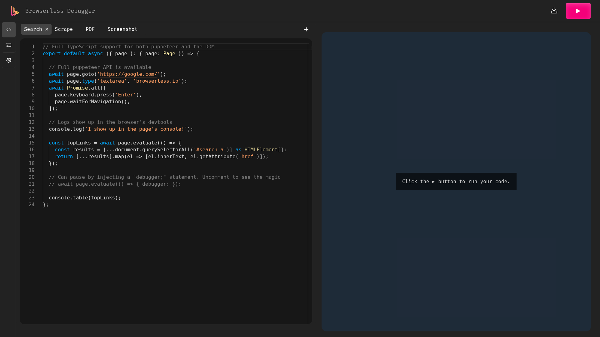

# Browserless

> Managed headless Chromium pool for scraping, PDF rendering, and page scripts via HTTP/WebSocket API.

## Debugger



## Ports

| Host | Purpose |
|------|---------|
| 26003 | HTTP REST API + WebSocket CDP |

## Quick start

```bash
./yai.sh start browserless
# API: http://localhost:26003
```

Set `BROWSERLESS_TOKEN` in `browserless/.env` before first start.

Use for scripted batch fetching and PDF/screenshot generation from n8n or other pipeline consumers.
For agent reasoning over live pages use the `agent-browser` skill instead.

## Docs

- Browserless docs: <https://docs.browserless.io/>
- Releases: <https://github.com/browserless/browserless/releases>
