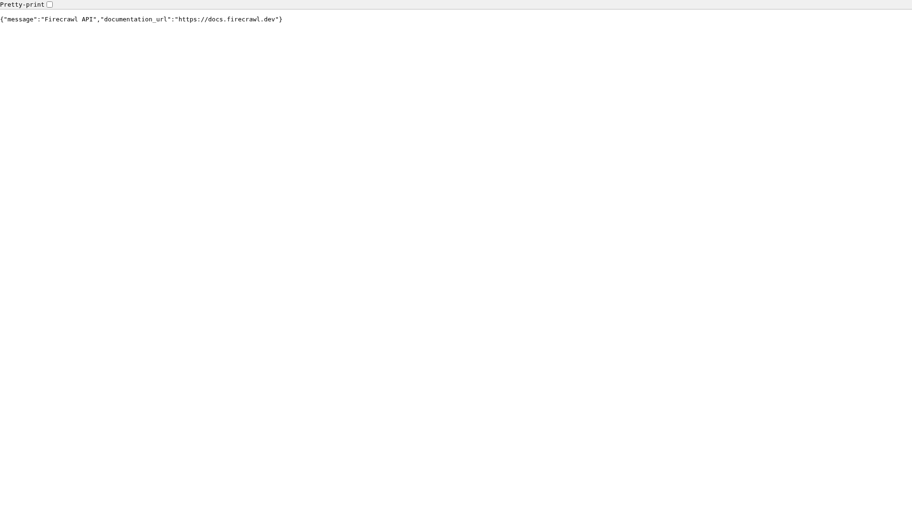

# Firecrawl

> Self-hosted web scraping and crawling API — renders pages through a headless browser and extracts content as markdown or structured JSON.

## API



## Ports

| Host | Purpose |
|------|---------|
| 21000 | REST API + queue admin UI |

## Quick start

```bash
./yai.sh start firecrawl
# API: http://localhost:21000
```

Use for "crawl this whole site and give me markdown" tasks.
For scripted single-page scraping prefer `browserless`; for agent reasoning over a live page use the `agent-browser` skill.

## Docs

- Firecrawl docs: <https://docs.firecrawl.dev/>
- Releases: <https://github.com/mendableai/firecrawl/releases>
