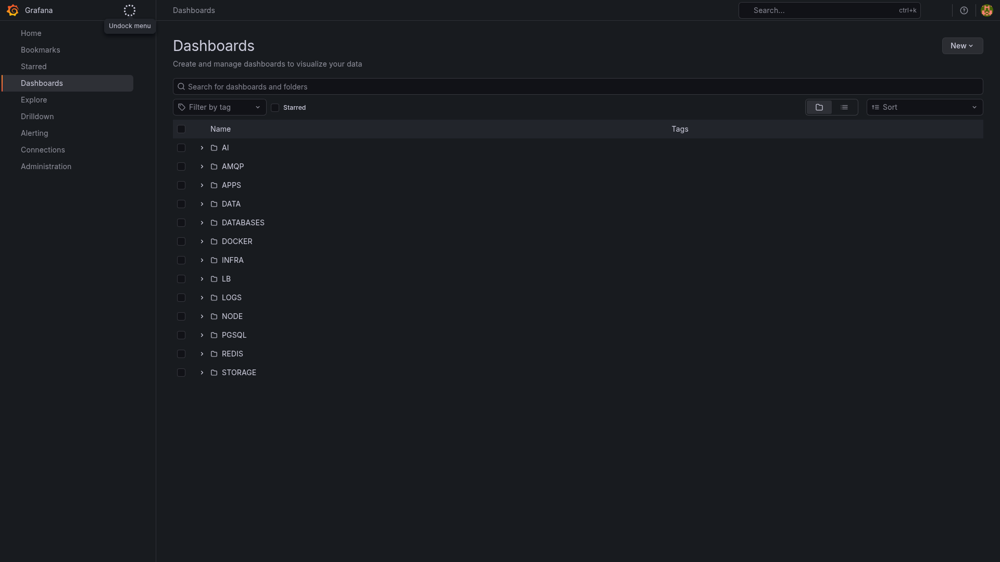
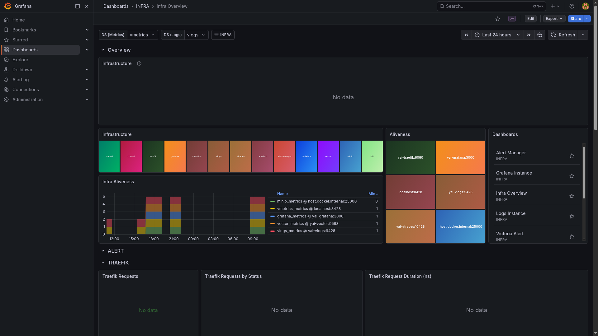

# Grafana

> Visualisation UI connected to VictoriaMetrics, VictoriaLogs, and VictoriaTraces for the full yai observability stack.

## Home



## Infra Overview dashboard



## Ports

| Host | Purpose |
|------|---------|
| 22000 | Grafana UI |

## Quick start

```bash
./yai.sh start grafana
# UI: http://localhost:22000
# Default login set by GRAFANA_ADMIN_USER / GRAFANA_ADMIN_PASSWORD in grafana/.env
```

Datasources are provisioned automatically on first start from `grafana/provisioning/datasources/`.
Dashboards are loaded from `grafana/dashboards/` via the provisioning config.

## Docs

- Grafana docs: <https://grafana.com/docs/grafana/latest/>
- Releases: <https://github.com/grafana/grafana/releases>
