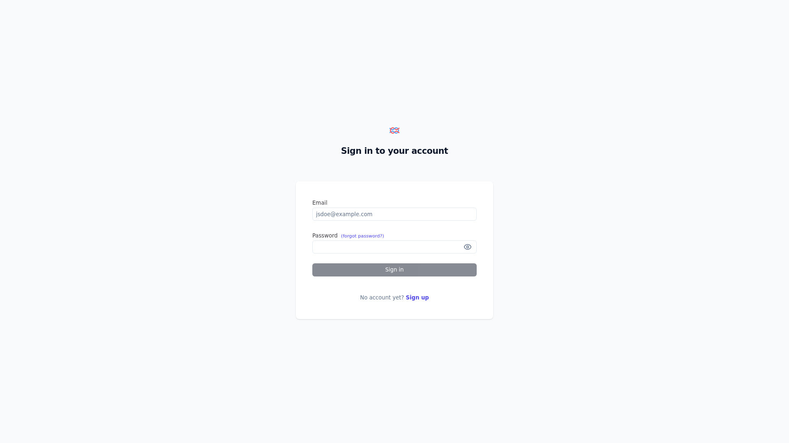

# Langfuse

> LLM observability platform capturing traces, metrics, evals, and prompts via SDK/OTEL exporters.

## UI



## Ports

| Host | Purpose |
|------|---------|
| 23000 | Web UI + ingestion API |
| 23090 | Internal MinIO S3 API (trace media payloads) |

## Quick start

```bash
# Rotate all secrets in langfuse/.env before first start
./yai.sh start langfuse
# Open http://localhost:23000 to register the first admin account
```

Wire OTLP traces from LiteLLM and other services to `http://host.docker.internal:23000/api/public/otel/v1/traces`.

## Docs

- Langfuse docs: <https://langfuse.com/docs>
- Self-host guide: <https://langfuse.com/docs/deployment/self-host>
- Releases: <https://github.com/langfuse/langfuse/releases>
