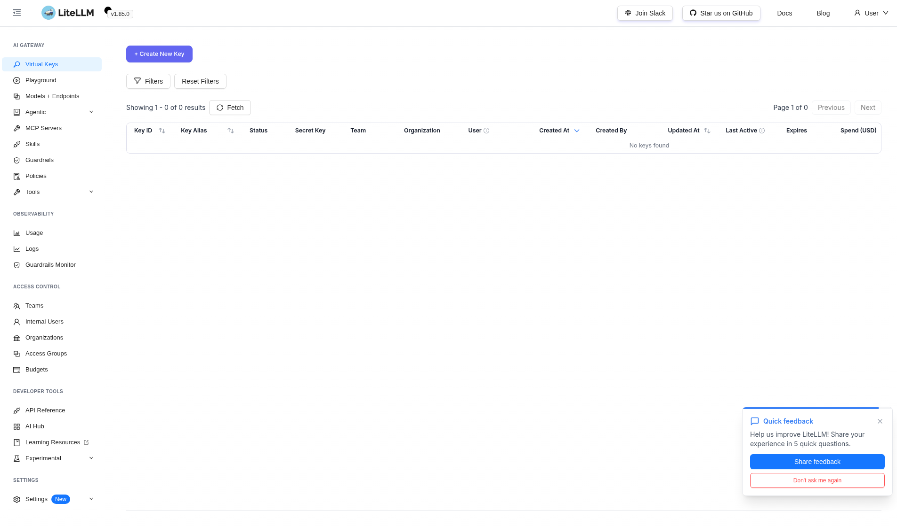
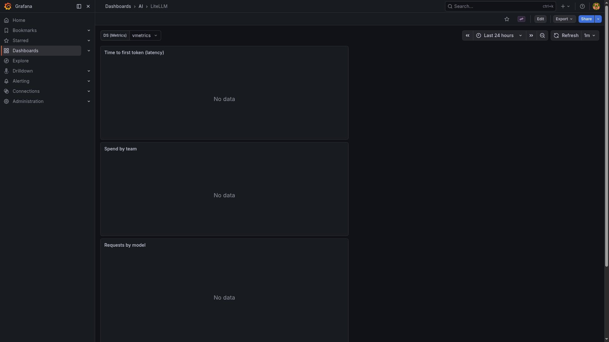

# LiteLLM

> OpenAI-compatible LLM gateway fronting 100+ providers with virtual keys, spend tracking, routing, and request/response logging.

## Dashboard



## Grafana metrics



## Ports

| Host | Purpose |
|------|---------|
| 24000 | OpenAI-compatible API + admin UI (`/ui`) |

## Quick start

```bash
# 1. Create the litellm database in the shared postgres instance
docker exec -it yai-postgres psql -U yai -d yai -c 'CREATE DATABASE litellm;'

# 2. Set credentials in litellm/.env
# LITELLM_MASTER_KEY, LITELLM_SALT_KEY, DATABASE_URL

# 3. Start
./yai.sh start litellm
# UI: http://localhost:24000/ui
# API: http://localhost:24000/v1
```

Point all in-stack consumers (`n8n`, `windmill`, `langfuse`) at `http://host.docker.internal:24000/v1` with the master key.

## Docs

- LiteLLM docs: <https://docs.litellm.ai/>
- Releases: <https://github.com/BerriAI/litellm/releases>
