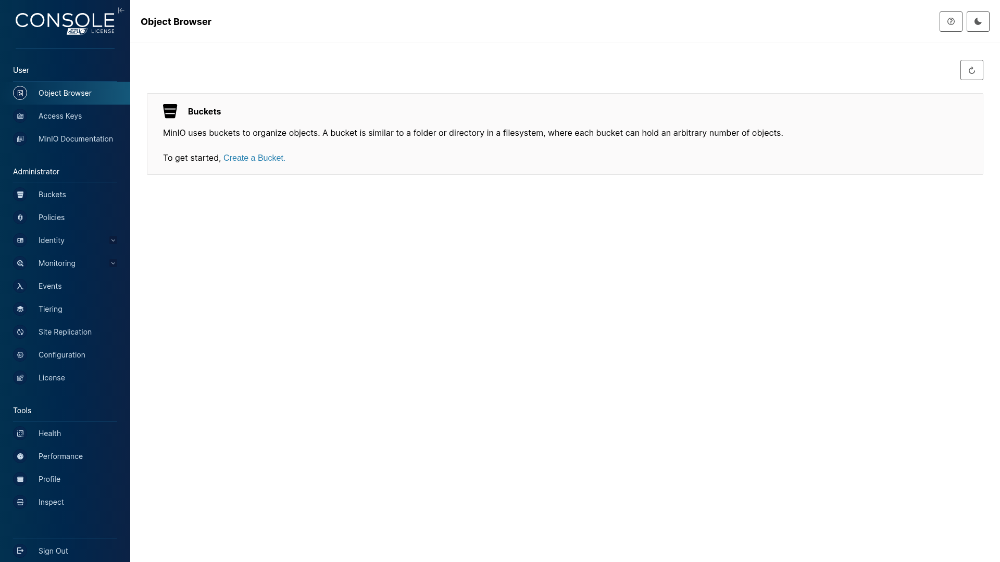
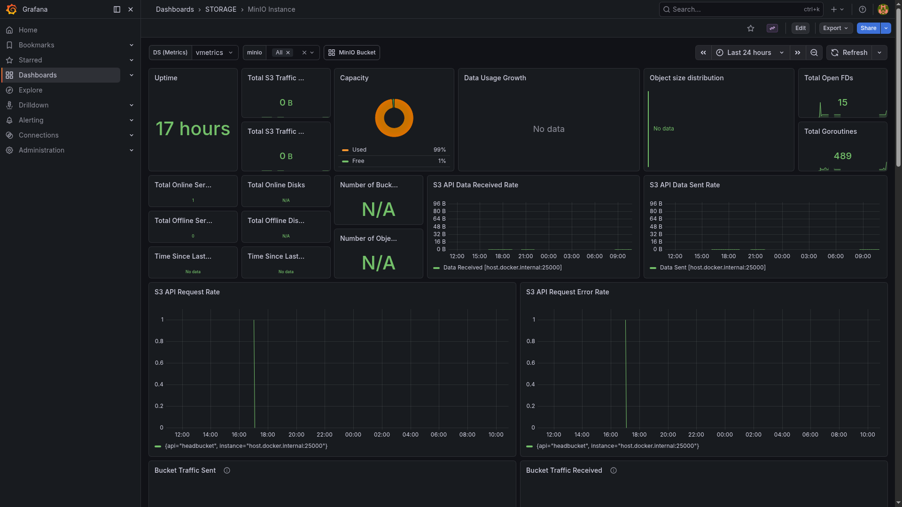

# MinIO

> S3-compatible object storage for the AI stack — model artifacts, RAG caches, workflow outputs.

## Console



## Grafana metrics



## Ports

| Host | Purpose |
|------|---------|
| 25000 | S3 API endpoint |
| 25001 | Web console |

## Quick start

```bash
./yai.sh start minio
# Console: http://localhost:25001
# S3 endpoint for SDK clients: http://localhost:25000
```

Set `MINIO_ROOT_USER` and `MINIO_ROOT_PASSWORD` in `minio/.env` before first start.

## Docs

- MinIO docs: <https://min.io/docs/minio/linux/index.html>
- pgsty fork (used here — upstream MinIO archived 2026-04-25): <https://github.com/pgsty/minio>
