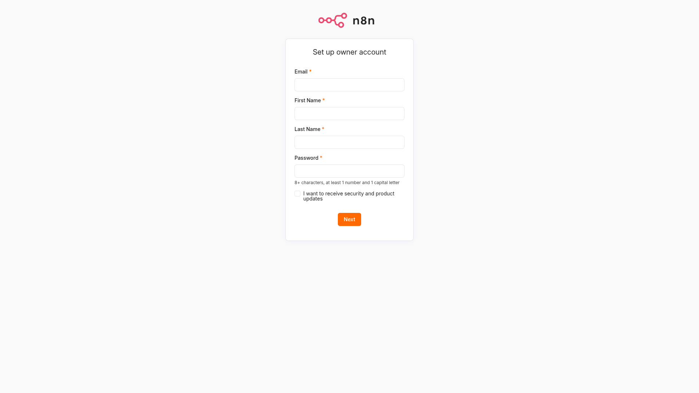
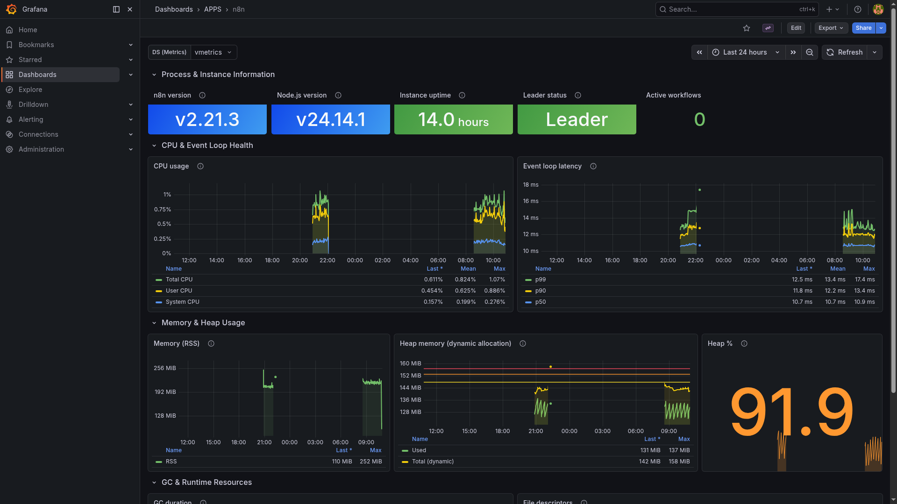

# n8n

> Low-code workflow automation in queue mode with embedded Postgres/Redis backend and external task runners for sandboxed code execution.

## Editor UI



## Grafana metrics



## Ports

| Host | Purpose |
|------|---------|
| 26002 | Editor UI, REST API, webhooks |

## Quick start

```bash
# Rotate secrets first
openssl rand -hex 32  # use for ENCRYPTION_KEY and RUNNERS_AUTH_TOKEN in n8n/.env

./yai.sh start n8n
# Open http://localhost:26002 to create the owner account on first run
```

Point all in-stack consumers to the LiteLLM gateway at `http://host.docker.internal:24000/v1`.

## Docs

- n8n docs: <https://docs.n8n.io/>
- Queue mode: <https://docs.n8n.io/hosting/scaling/queue-mode/>
- Releases: <https://github.com/n8n-io/n8n/releases>
