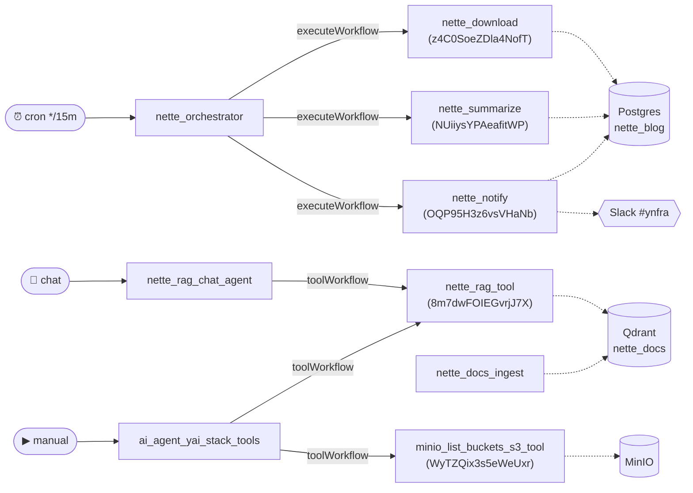

# n8n workflows — yai stack

This folder holds the importable n8n workflow definitions for the yai stack.
Each `*.json` is a standalone n8n workflow; this README documents every one of
them — **goal, trigger, input, output, nodes, and tech stack**.

The `cand_*` batch has additional adoption/testing notes in
[`cand_README.md`](./cand_README.md). `nette_blog_init.sql` is not a workflow —
it is the bootstrap schema for the Nette blog pipeline (see
[Nette blog pipeline](#nette-blog-pipeline)).

## How to import

```bash
# UI: n8n editor (http://localhost:26002) → Workflows → Import from File
# CLI inside the container:
docker exec -i yai-n8n n8n import:workflow --input=/path/in/container.json
```

## Shared tech stack & conventions

All workflows target in-stack services over `host.docker.internal` and reuse a
small set of credentials:

| Concern | Mechanism | Credential | Endpoint / detail |
|---|---|---|---|
| **LLM (chat)** | `lmChatOpenAi` / `chainLlm` / `agent` | `yai-litellm` | LiteLLM `:24000`, default model `openrouter/openai/gpt-oss-120b:free` |
| **LLM (alt)** | `lmChatOpenRouter` | `yai-openrouter` | OpenRouter direct (only `nette_rag_chat`) |
| **Embeddings** | `embeddingsOpenAi` / raw HTTP | `yai-litellm` | model `openrouter/nvidia/llama-nemotron-embed-vl-1b-v2:free` |
| **Vector store** | `vectorStoreQdrant` / raw HTTP | `yai-qdrant` | Qdrant `:26000` |
| **Scraping** | `httpRequest` / `toolHttpRequest` | _(none)_ | Firecrawl `:21000` (`/v1/scrape`, `/map`, `/crawl`, `/search`) |
| **Browser** | `httpRequest` | _(none)_ | Browserless `:26003` (`/screenshot`, `/scrape`) |
| **Object storage** | `s3` node or SigV4-signed `httpRequest` | `yai-minio-s3` | MinIO `:25000` |
| **Relational** | `postgres` | `yai-postgres-nette` | DB `nette_blog` |
| **Notifications** | `slack` | `yai-slack` | channel `#ynfra` |
| **Tracing** | _(automatic)_ | — | Langfuse via LiteLLM success callback (no node) |

> **Note on MinIO auth.** The Browserless/MinIO HTTP workflows sign requests
> with AWS SigV4 in a Code node using **hard-coded** `admin` / `Admin1234!`
> keys. The native-`s3`-node workflows use the `yai-minio-s3` credential
> instead. Prefer the credential path for anything new.

## Index

| # | Workflow | Goal | Trigger | Nodes | Services |
|---|---|---|---|---|---|
| | **AI / RAG** | | | | |
| 1 | `ai_basic_llm_chain` | Structured sentiment/triage of a text report | Manual | 5 | LiteLLM |
| 2 | `ai_agent_with_memory` | Tool-using agent (calculator + time) with session memory | Manual | 7 | LiteLLM |
| 3 | `ai_agent_yai_stack_tools` | Agent that introspects the whole yai stack via tools | Manual | 10 | LiteLLM, VM/VL/VT, MinIO, Firecrawl |
| 4 | `ai_rag_ingest_firecrawl_qdrant` | Scrape → chunk → embed → Qdrant ingest | Webhook `rag/ingest` | 8 | Firecrawl, Qdrant, LiteLLM |
| 5 | `ai_rag_query_qdrant_q_a` | RAG Q&A over Qdrant | Webhook `rag/query` | 7 | Qdrant, LiteLLM |
| 6 | `rag_nette_docs` | All-in-one Nette docs RAG (crawl + index + chat) | Manual + Chat | 18 | Firecrawl, Qdrant, LiteLLM |
| 7 | `qdrant_point_search_demo` | Hand-built vector similarity-search demo | Manual | 6 | Qdrant |
| | **Firecrawl** | | | | |
| 8 | `firecrawl_scrape_url` | Scrape one URL → markdown + links | Manual | 4 | Firecrawl |
| 9 | `firecrawl_map_website` | Enumerate a site's links | Manual | 4 | Firecrawl |
| 10 | `firecrawl_crawl_website` | Async crawl a site, poll, extract pages | Manual | 6 | Firecrawl |
| 11 | `firecrawl_search` | Web search via Firecrawl | Manual | 4 | Firecrawl |
| | **Browserless** | | | | |
| 12 | `browserless_screenshot` | Screenshot a page → binary PNG | Manual | 4 | Browserless |
| 13 | `browserless_scrape_elements` | Scrape DOM elements by selector | Manual | 4 | Browserless |
| 14 | `browserless_minio_screenshot_to_storage` | Screenshot → upload to MinIO | Webhook + Manual | 9 | Browserless, MinIO |
| | **MinIO** | | | | |
| 15 | `minio_list_buckets` | List buckets via signed HTTP | Manual | 4 | MinIO |
| 16 | `minio_list_buckets_s3_tool` | List buckets as a reusable sub-workflow tool | Sub-workflow | 2 | MinIO |
| 17 | `minio_upload_download` | Create bucket, upload + download a file | Manual | 8 | MinIO |
| | **Core (no external service)** | | | | |
| 18 | `core_batch_processing` | Filter/sort/batch/enrich/summarize synthetic events | Manual | 8 | — |
| 19 | `core_data_ops` | Merge, dedupe, split-out tags | Manual | 9 | — |
| 20 | `core_webhook_branching` | Route webhook events by priority/type | Webhook `examples/events` | 8 | — |
| | **Slack** | | | | |
| 21 | `slack_send_message` | Minimal "send a Slack message" template | Manual | 2 | Slack |
| | **Nette blog pipeline** | | | | |
| 22 | `nette_orchestrator` | Cron driver: Download → Summarize → Notify | Schedule 15m + Manual | 7 | sub-workflows |
| 23 | `nette_download` | RSS → fetch article HTML → Postgres (`pending`) | Sub-workflow + Manual | 11 | Postgres, RSS |
| 24 | `nette_summarize` | LLM-summarize pending articles (`summarized`) | Sub-workflow + Manual | 8 | LiteLLM, Postgres |
| 25 | `nette_notify` | Post summaries to Slack (`notified`) | Sub-workflow + Manual | 7 | Postgres, Slack |
| | **Nette docs RAG** | | | | |
| 26 | `nette_docs_ingest` | Scrape ~160 doc URLs → embed → Qdrant | Webhook + Manual | 10 | Firecrawl, LiteLLM, Qdrant |
| 27 | `nette_rag_tool` | Qdrant semantic-search utility (agent tool) | Sub-workflow | 4 | Qdrant, LiteLLM |
| 28 | `nette_rag_chat_agent` | Chat agent that calls the RAG tool | Chat | 4 | LiteLLM, Qdrant (via tool) |
| 29 | `nette_rag_chat` | Variant chat UI w/ memory + direct vector store | Chat | 11 | OpenRouter, LiteLLM, Qdrant |
| | **Candidate batch** (see `cand_README.md`) | | | | |
| 30 | `cand_lead_enrichment_research` | Company research → structured firmographics → Postgres | Manual | 10 | Firecrawl, LiteLLM, Postgres |
| 31 | `cand_page_change_monitor` | Daily page-diff → LLM summary → Slack | Schedule 24h | 11 | Firecrawl, LiteLLM, Postgres, Slack |
| 32 | `cand_reasoning_agent` | Plan-then-act reasoning agent (Langfuse showcase) | Manual | 8 | LiteLLM |
| 33 | `cand_website_chat_rag_ingest` | Map a whole site → embed N pages → Qdrant | Manual | 10 | Firecrawl, LiteLLM, Qdrant |

---

## Inter-workflow call graph

Only four workflows call others. The orchestrator fans out via `executeWorkflow`;
the two agents pull sub-workflows in as `toolWorkflow` tools. Dashed edges are
shared data stores (not calls). Workflow IDs in parentheses are the references
embedded in the calling JSON.



> All other workflows are standalone (manual / webhook / schedule / chat) and
> do not invoke another workflow.

---

## AI / RAG

### 1. `ai_basic_llm_chain`
- **Goal:** Analyse a free-text incident report and return strict-JSON sentiment analysis.
- **Trigger:** Manual.
- **Input:** Static report text in a Set node.
- **Output:** JSON `{ sentiment, confidence (0–1), summary, keywords[≤5], action_required }`.
- **Nodes (5):** `manualTrigger` → `set` (input) → `chainLlm` ← `lmChatOpenAi` (LiteLLM, gpt-oss-120b) + `outputParserStructured` (schema enforcement).
- **Tech stack:** LiteLLM only.

### 2. `ai_agent_with_memory`
- **Goal:** Infra-assistant agent that does arithmetic and reports time, with persistent session memory.
- **Trigger:** Manual.
- **Input:** Static multi-part question in a Set node.
- **Output:** Text answer with calculations, `2^10`, current UTC time, and a summary.
- **Nodes (7):** `manualTrigger` → `set` → `agent` ← `lmChatOpenAi` + `memoryBufferWindow` (window 10, `sessionKey: default`) + `toolCalculator` + `toolCode` (Get Time, ISO-8601 UTC).
- **Tech stack:** LiteLLM; buffer-window memory.

### 3. `ai_agent_yai_stack_tools`
- **Goal:** Agent that introspects the running stack — buckets, metrics, logs, traces, web, docs — and summarises findings.
- **Trigger:** Manual.
- **Input:** Static query in a Set node.
- **Output:** Text summary of the stack state.
- **Nodes (10):** `manualTrigger` → `set` → `agent` ← `lmChatOpenAi` and six tools: `toolHttpRequest` ×3 (VictoriaMetrics `:28428` PromQL, VictoriaLogs `:29428` LogsQL, VictoriaTraces `:21428` Jaeger services), `toolHttpRequest` (Firecrawl `/v1/scrape`), `toolWorkflow` ×2 (MinIO list-buckets sub-workflow `WyTZQix3s5eWeUxr`; Nette Docs RAG sub-workflow `8m7dwFOIEGvrjJ7X`).
- **Tech stack:** LiteLLM, VictoriaMetrics/Logs/Traces, MinIO, Firecrawl, Nette RAG tool.

### 4. `ai_rag_ingest_firecrawl_qdrant`
- **Goal:** Generic RAG ingest — scrape a URL, chunk, embed, upsert into Qdrant.
- **Trigger:** Webhook `POST rag/ingest` (`{url}`, defaults to n8n cluster-nodes docs).
- **Input:** Webhook body `url`.
- **Output:** Vectors upserted into Qdrant collection `rag_examples`.
- **Nodes (8):** `webhook` → `set` (URL/default) → `httpRequest` (Firecrawl `/v1/scrape`) → `code` (extract markdown+metadata) → `vectorStoreQdrant` (insert) ← `embeddingsOpenAi` + `textSplitterRecursiveCharacter` (500/50) + `documentDefaultDataLoader`.
- **Tech stack:** Firecrawl, Qdrant (`rag_examples`), LiteLLM embeddings.

### 5. `ai_rag_query_qdrant_q_a`
- **Goal:** Answer a question over the Qdrant `rag_examples` collection (RAG Q&A).
- **Trigger:** Webhook `POST rag/query` (response mode = responseNode).
- **Input:** Webhook body question.
- **Output:** JSON `{ answer }`.
- **Nodes (7):** `webhook` → `chainRetrievalQa` ← `lmChatOpenAi` + `retrieverVectorStore` ← `vectorStoreQdrant` (`rag_examples`) ← `embeddingsOpenAi`; → `respondToWebhook`.
- **Tech stack:** Qdrant, LiteLLM.

### 6. `rag_nette_docs`
- **Goal:** Self-contained Nette docs RAG — crawl & index the docs **and** expose a chat Q&A interface in one workflow.
- **Trigger:** Manual (indexing) **and** `chatTrigger` (path `/chat`).
- **Input:** Indexing — hard-coded `doc.nette.org` / `contributte.org` maps (limit 500); Chat — user message.
- **Output:** Indexing → vectors in Qdrant `nette_docs`; Chat → cited LLM answer.
- **Nodes (18):** map (`httpRequest` ×2, Contributte disabled) → `merge` → `code` (filter/dedupe by domain+lang) → `splitInBatches` → `httpRequest` (Qdrant existence check) → `if` → `httpRequest` (Firecrawl scrape) → `code` (prepare) → `vectorStoreQdrant` ← `documentDefaultDataLoader` + `embeddingsOpenAi` (nvidia nemotron-embed); chat side: `chatTrigger` → `chainRetrievalQa` ← `lmChatOpenAi` (`openrouter/google/gemini-2.5-flash-lite`) + `retrieverVectorStore` (topK 10) ← `vectorStoreQdrant` ← `embeddingsOpenAi`; → `chat`.
- **Tech stack:** Firecrawl, Qdrant (`nette_docs`), LiteLLM (embed nemotron, chat gemini-2.5-flash-lite). Overlaps the modular `nette_docs_ingest` + `nette_rag_*` set below.

### 7. `qdrant_point_search_demo`
- **Goal:** End-to-end Qdrant demo: create a collection, upsert hand-made vectors, run a similarity search.
- **Trigger:** Manual.
- **Input:** None — 6 hard-coded 4-D product vectors + a query vector in a Code node.
- **Output:** JSON top-3 matches `{ rank, score, name, category, price }`.
- **Nodes (6):** `manualTrigger` → `code` (sample data) → `httpRequest` (PUT `/collections/qdrant_demo`, size 4 / cosine) → `httpRequest` (upsert points) → `httpRequest` (search) → `code` (format).
- **Tech stack:** Qdrant (`qdrant_demo`), cosine distance.

## Firecrawl

All four are Manual + `set` config + `httpRequest` to Firecrawl + a `code` formatter; default target `https://doc.nette.org`.

### 8. `firecrawl_scrape_url`
- **Goal:** Scrape a single URL to markdown + links.
- **Output:** `{ success, title, url, status, word_count, links_count, markdown_preview (800c), top_links[10] }`.
- **Nodes (4):** `manualTrigger` → `set` → `httpRequest` (`/v1/scrape`) → `code`.

### 9. `firecrawl_map_website`
- **Goal:** Enumerate a site's discoverable links.
- **Input:** `url`, `limit` (50). **Output:** `{ success, total_links, links_preview[20], all_links[] }`.
- **Nodes (4):** `manualTrigger` → `set` → `httpRequest` (`/v1/map`) → `code`.

### 10. `firecrawl_crawl_website`
- **Goal:** Async-crawl a site, wait, then extract pages.
- **Input:** `url`, `limit` (5). **Output:** `{ job_status, completed, total, pages[{url,title,words,markdown(300c)}] }`.
- **Nodes (6):** `manualTrigger` → `set` → `httpRequest` (`/v1/crawl`, get job id) → `code` (fixed 5 s wait) → `httpRequest` (`/v1/crawl/{id}` status) → `code` (extract). ⚠️ Fixed delay, no retry loop — may under-wait large crawls.

### 11. `firecrawl_search`
- **Goal:** Web search via Firecrawl.
- **Input:** `query` (default "nette PHP framework"), `limit` (5). **Output:** `{ success, job_id, total_results, results[{url,title,description}] }`.
- **Nodes (4):** `manualTrigger` → `set` → `httpRequest` (`/v1/search`) → `code`.

## Browserless

### 12. `browserless_screenshot`
- **Goal:** Screenshot a page and return binary-PNG metadata.
- **Trigger:** Manual. **Input:** `url` (`grafana.com`), `fullPage` (false).
- **Output:** Binary PNG + JSON metadata (`mime_type`, `file_name`, `size_bytes`, tip).
- **Nodes (4):** `manualTrigger` → `set` → `httpRequest` (`/screenshot`, responseFormat=file) → `code`.
- **Tech stack:** Browserless `:26003`.

### 13. `browserless_scrape_elements`
- **Goal:** Scrape specific DOM elements (h1/h2/p/a) by CSS selector.
- **Trigger:** Manual. **Input:** `url` (Hacker News) + selectors.
- **Output:** JSON `{ url, headings_h1[], headings_h2[≤10], paragraphs[≤5], links[≤20 unique] }`.
- **Nodes (4):** `manualTrigger` → `set` → `httpRequest` (`/scrape`) → `code` (group/limit/extract).
- **Tech stack:** Browserless `:26003`.

### 14. `browserless_minio_screenshot_to_storage`
- **Goal:** Screenshot a URL and persist the PNG to MinIO.
- **Trigger:** Webhook `POST screenshot-to-minio` or Manual. **Input:** `url`.
- **Output:** JSON `{ success, filename, minio_url, bucket: "screenshots", source_url }`.
- **Nodes (9):** `webhook`/`manualTrigger` → `set` (extract URL) → `code` (sign create-bucket) → `httpRequest` (create `screenshots` bucket) → `httpRequest` (Browserless `/screenshot`) → `code` (sign upload) → `s3` (upload, `yai-minio-s3`) → `set` (response).
- **Tech stack:** Browserless `:26003`, MinIO `:25000` (mixed SigV4 + `s3` credential).

## MinIO

### 15. `minio_list_buckets`
- **Goal:** List buckets via a manually SigV4-signed GET.
- **Trigger:** Manual. **Output:** `{ bucket_count, buckets[{name,created}], tip }`.
- **Nodes (4):** `manualTrigger` → `code` (sign) → `httpRequest` (GET `/`) → `code` (regex-parse XML).
- **Tech stack:** MinIO `:25000` (hard-coded SigV4 keys).

### 16. `minio_list_buckets_s3_tool`
- **Goal:** Same listing, but as a reusable sub-workflow tool using the native S3 node.
- **Trigger:** `executeWorkflowTrigger` (called by `ai_agent_yai_stack_tools`).
- **Output:** Bucket list from `s3` getAll.
- **Nodes (2):** `executeWorkflowTrigger` → `s3` (getAll, `yai-minio-s3`).
- **Tech stack:** MinIO via `yai-minio-s3` credential.

### 17. `minio_upload_download`
- **Goal:** Create a bucket, upload a text file, then download and display it (round-trip verification).
- **Trigger:** Manual. **Input:** None (hard-coded bucket `examples`, object `hello.txt`).
- **Output:** JSON `{ success, bucket, object, downloaded_content, size_bytes }`.
- **Nodes (8):** `manualTrigger` → sign+`httpRequest` (create bucket) → sign+`httpRequest` (upload) → sign+`httpRequest` (download) → `code` (show content).
- **Tech stack:** MinIO `:25000` (hard-coded SigV4 keys).

## Core (no external service)

Pure-n8n teaching examples — no credentials, no network.

### 18. `core_batch_processing`
- **Goal:** Filter / sort / batch / enrich / summarise synthetic infra events.
- **Trigger:** Manual. **Input:** None (generates 20 events). **Output:** Enriched items + per-category stats (count/sum/avg/max).
- **Nodes (8):** `manualTrigger` → `code` (generate 20) → `filter` (active & value>30) → `sort` (desc) → `splitInBatches` (5) → `code` (enrich tier/score) → `aggregate` → `summarize`.

### 19. `core_data_ops`
- **Goal:** Merge two overlapping datasets, dedupe by id, extract unique tags.
- **Trigger:** Manual. **Input:** None (two hard-coded teams, ids 3–4 overlap). **Output:** Sorted unique people + unique tags.
- **Nodes (9):** `manualTrigger` → `code` ×2 (teams) → `merge` → `removeDuplicates` (by id) → `sort` → `splitOut` (tags) → `removeDuplicates` (tags) → `aggregate`.

### 20. `core_webhook_branching`
- **Goal:** Receive events and route by priority then type.
- **Trigger:** Webhook `POST examples/events` (responseNode). **Input:** `{ priority, type(error|warning|info|other), message, service }`.
- **Output:** JSON formatted+routed message (PagerDuty/error-queue/Slack/logs by branch).
- **Nodes (8):** `webhook` → `if` (high priority) → `code` (high-priority format) / `switch` (by type) → `code` ×3 (error/warning/info format) → `respondToWebhook`.

## Slack

### 21. `slack_send_message`
- **Goal:** Minimal "post a message to Slack" template.
- **Trigger:** Manual. **Nodes (2):** `manualTrigger` → `slack` (v2.5, `yai-slack`).
- **Tech stack:** Slack.

## Nette blog pipeline

A coordinated RSS→summary→Slack system over Postgres DB `nette_blog`
(table `rss_articles`, state machine `pending → summarized → notified`,
schema in `nette_blog_init.sql`). The orchestrator drives three sub-workflows.

```
nette_orchestrator  (cron */15m)
   ├─▶ nette_download   RSS → article HTML → INSERT (state=pending)
   ├─▶ nette_summarize  pending → LLM summary → UPDATE (state=summarized)
   └─▶ nette_notify     summarized → Slack #ynfra → UPDATE (state=notified)
```

### 22. `nette_orchestrator`
- **Goal:** Run the three stages in sequence on a schedule.
- **Trigger:** Schedule `*/15 * * * *` + Manual.
- **Nodes (7):** `scheduleTrigger`/`manualTrigger` → `executeWorkflow` (Download `z4C0SoeZDla4NofT`) → `aggregate` → `executeWorkflow` (Summarize `NUiiysYPAeafitWP`) → `aggregate` → `executeWorkflow` (Notify `OQP95H3z6vsVHaNb`).

### 23. `nette_download`
- **Goal:** Read the Czech Nette blog RSS, fetch each new article's HTML, store as `pending`.
- **Trigger:** `executeWorkflowTrigger` + Manual. **Input:** none (RSS `blog.nette.org/cs/feed/rss`).
- **Output:** Rows in `rss_articles` (`INSERT … ON CONFLICT DO NOTHING`).
- **Nodes (11):** `rssFeedRead` → `code` (last 30d, sort) → `splitInBatches` → `code` (MD5 guid) → `postgres` (lookup) → `if` (new?) → `httpRequest` (fetch HTML) → `code` (extract `<article>`/`<main>`, strip, ≤10 KB) → `postgres` (insert).
- **Tech stack:** Postgres `nette_blog`, RSS.

### 24. `nette_summarize`
- **Goal:** LLM-summarise `pending` articles into 3 sentences; mark `summarized`.
- **Trigger:** `executeWorkflowTrigger` + Manual. **Output:** `UPDATE summary, state='summarized'`.
- **Nodes (8):** `postgres` (fetch pending, ≤50) → `splitInBatches` → `code` (prompt, content ≤8 KB) → `chainLlm` ← `lmChatOpenAi` (gpt-oss-120b, maxTokens 400) → `postgres` (update).
- **Tech stack:** LiteLLM, Postgres.

### 25. `nette_notify`
- **Goal:** Post `summarized` articles to Slack `#ynfra`; mark `notified`.
- **Trigger:** `executeWorkflowTrigger` + Manual. **Output:** Slack messages + `UPDATE state='notified'`.
- **Nodes (7):** `postgres` (fetch summarized, ≤50) → `splitInBatches` → `code` (format markdown, DD.MM.YYYY) → `slack` (#ynfra) → `postgres` (update) → `wait` (5 s rate-limit).
- **Tech stack:** Postgres, Slack.

## Nette docs RAG

Modular counterpart to the all-in-one `rag_nette_docs` (#6). Shared Qdrant
collection `nette_docs`; embeddings `openrouter/nvidia/llama-nemotron-embed-vl-1b-v2:free`.

### 26. `nette_docs_ingest`
- **Goal:** Scrape ~160 Nette/Contributte doc URLs and index them into Qdrant.
- **Trigger:** Webhook `nette-docs-ingest` + Manual. **Input:** URL list in a Code node (or webhook passthrough).
- **Output:** Upserts into Qdrant `nette_docs`; no HTTP response.
- **Nodes (10):** `webhook`/`manualTrigger` → `code` (URL list) → `splitInBatches` → `httpRequest` (Firecrawl scrape) → `code` (chunk <2000c) → `if` (has content) → `httpRequest` (LiteLLM `/v1/embeddings`) → `code` (build UUID points + metadata) → `qdrant` (upsert).
- **Tech stack:** Firecrawl, LiteLLM embeddings, Qdrant.

### 27. `nette_rag_tool`
- **Goal:** Semantic-search utility over `nette_docs`, callable as an agent tool.
- **Trigger:** `executeWorkflowTrigger` (input `query` string).
- **Output:** Markdown passages with source URLs (topK 6).
- **Nodes (4):** `executeWorkflowTrigger` → `vectorStoreQdrant` (mode=load, topK 6) ← `embeddingsOpenAi` → `code` (format passages+sources).
- **Tech stack:** Qdrant (`nette_docs`), LiteLLM embeddings. Called by #3 and #28.

### 28. `nette_rag_chat_agent`
- **Goal:** Chat agent that answers Nette questions by first calling the RAG tool, then citing sources.
- **Trigger:** `chatTrigger` (hosted, "Nette RAG", streaming).
- **Nodes (4):** `chatTrigger` → `agent` ← `lmChatOpenAi` (gpt-oss-120b) + `toolWorkflow` (Nette RAG Tool `8m7dwFOIEGvrjJ7X`).
- **Tech stack:** LiteLLM; Qdrant via #27.

### 29. `nette_rag_chat`
- **Goal:** Variant chat UI with window memory and a direct vector-store tool.
- **Trigger:** `chatTrigger` (hosted, streaming).
- **Nodes (11):** `chatTrigger` → `agent` ← `lmChatOpenRouter` (`openai/gpt-oss-120b:free`, `yai-openrouter`) + `memoryBufferWindow` (40) + `toolVectorStore` ← `vectorStoreQdrant` (`nette_docs`) ← `embeddingsOpenAi`; → `set` (respond); `googleDrive` (disabled); 5× `stickyNote`.
- ⚠️ **Caveat:** the agent system message still carries leftover "Nostr/Damus" template text — adapt before relying on it.
- **Tech stack:** OpenRouter (chat), LiteLLM (embed), Qdrant.

## Candidate batch (`cand_*`)

Trial adaptations of popular public templates, re-pointed at yai. Adoption /
testing notes and the embeddings caveat live in
[`cand_README.md`](./cand_README.md).

### 30. `cand_lead_enrichment_research`
- **Goal:** Given a company name, find its site, scrape it, extract firmographics, store to Postgres.
- **Trigger:** Manual. **Input:** company name (`Nette Foundation`).
- **Output:** Row in `lead_enrichment` (`company_name, website, industry, description, hq_location, employee_range, key_products, source_url`).
- **Nodes (10):** `manualTrigger` → `set` → `postgres` (ensure table) → `httpRequest` (Firecrawl `/v1/search`) → `code` (top URL) → `httpRequest` (Firecrawl `/v1/scrape`) → `code` (prepare, ≤12 KB) → `informationExtractor` ← `lmChatOpenAi` (gpt-oss-120b) → `postgres` (insert).
- **Tech stack:** Firecrawl, LiteLLM, Postgres. New node type: `informationExtractor`.

### 31. `cand_page_change_monitor`
- **Goal:** Detect changes on a watched page, summarise the diff, alert Slack.
- **Trigger:** Schedule (24 h). **Input:** `url` (n8n release-notes), `slack_channel`.
- **Output:** Slack diff summary; snapshot persisted to `page_snapshots`.
- **Nodes (11):** `scheduleTrigger` → `set` → `postgres` (ensure table) → `httpRequest` (Firecrawl scrape) → `postgres` (get previous) → `code` (compare) → `if` (changed) → `chainLlm` ← `lmChatOpenAi` → `slack` → `postgres` (store snapshot). First run posts a baseline alert.
- **Tech stack:** Firecrawl, LiteLLM, Postgres, Slack.

### 32. `cand_reasoning_agent`
- **Goal:** Plan-then-act agent (must call a `plan` tool first, `calculator` for all math) — clean Langfuse trace showcase.
- **Trigger:** Manual. **Input:** hard-coded multi-step throughput problem; `session_id` `reasoning-demo-1`.
- **Output:** Reasoning trace + final answer.
- **Nodes (8):** `manualTrigger` → `set` → `agent` (maxIter 12) ← `lmChatOpenAi` + `memoryBufferWindow` (15) + `toolCode` (Plan) + `toolCalculator` + `toolCode` (Get Time).
- **Tech stack:** LiteLLM; window memory.

### 33. `cand_website_chat_rag_ingest`
- **Goal:** Map a whole site, scrape the first N pages, embed into a dedicated Qdrant collection.
- **Trigger:** Manual. **Input:** `domain` (`docs.n8n.io`), `max_pages` (10).
- **Output:** Vectors in Qdrant `website_chat` with `{url,title,scraped_at}`.
- **Nodes (10):** `manualTrigger` → `set` → `httpRequest` (Firecrawl `/v1/map`) → `code` (expand+limit) → `httpRequest` (Firecrawl `/v1/scrape`) → `code` (prepare) → `vectorStoreQdrant` (`website_chat`) ← `embeddingsOpenAi` + `textSplitterRecursiveCharacter` (500/50) + `documentDefaultDataLoader`.
- **Tech stack:** Firecrawl, LiteLLM embeddings, Qdrant.
</content>
</invoke>
