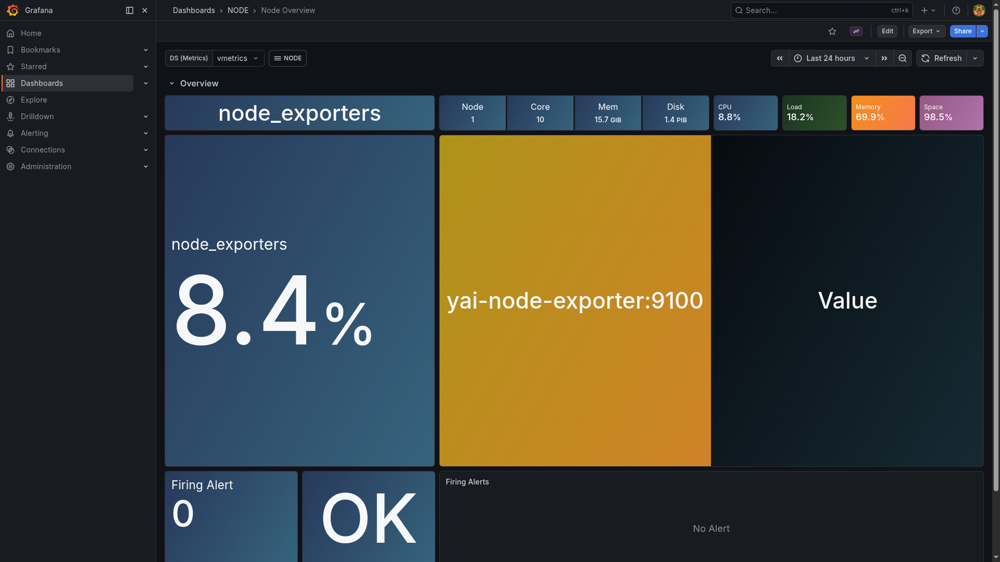

# Node Exporter

> Prometheus Node Exporter exposing host OS metrics — CPU, memory, disk, network — from the Docker VM.

## Grafana dashboard



## Ports

Node Exporter has no host-exposed port. It runs on the `yai-infra` network and is scraped by VictoriaMetrics at `yai-node-exporter:9100`.

## Quick start

```bash
./yai.sh start node-exporter
```

Metrics are visible in Grafana via the **Node Overview** and **Node Exporter** dashboards.

## Docs

- Node Exporter: <https://github.com/prometheus/node_exporter>
- Releases: <https://github.com/prometheus/node_exporter/releases>
