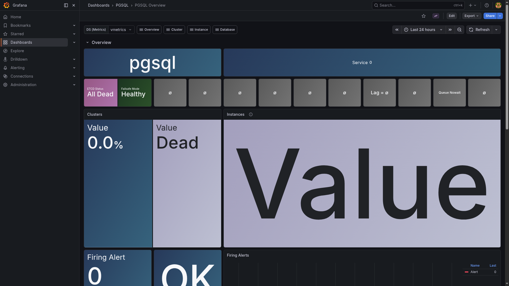

# PostgreSQL

> Shared PostgreSQL 17 instance for LiteLLM and general-purpose dev workloads.

## Grafana dashboard



## Ports

| Host | Purpose |
|------|---------|
| 25432 | SQL (PostgreSQL wire protocol) |

## Quick start

```bash
# Set POSTGRES_PASSWORD in postgres/.env
./yai.sh start postgres

# Connect
psql -h localhost -p 25432 -U yai -d yai

# Create LiteLLM database (required before starting litellm)
docker exec -it yai-postgres psql -U yai -d yai -c 'CREATE DATABASE litellm;'
```

Connection string: `postgresql://yai:<password>@localhost:25432/yai`

**Note:** `n8n`, `windmill`, `firecrawl`, and `langfuse` each embed their own private Postgres instance. Do not consolidate them here.

## Docs

- PostgreSQL docs: <https://www.postgresql.org/docs/17/>
- pg_exporter: <https://github.com/Vonng/pg_exporter>
