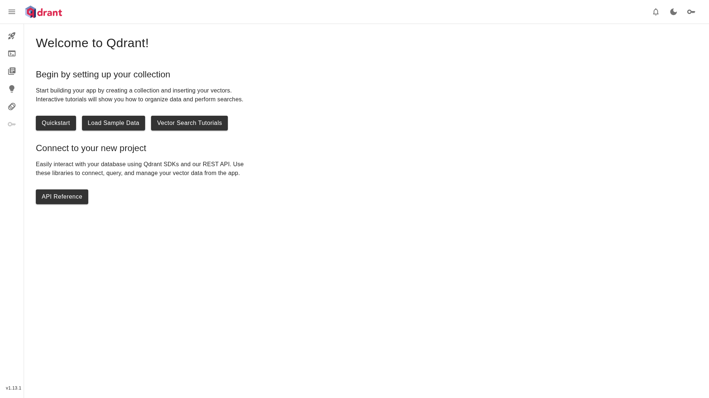
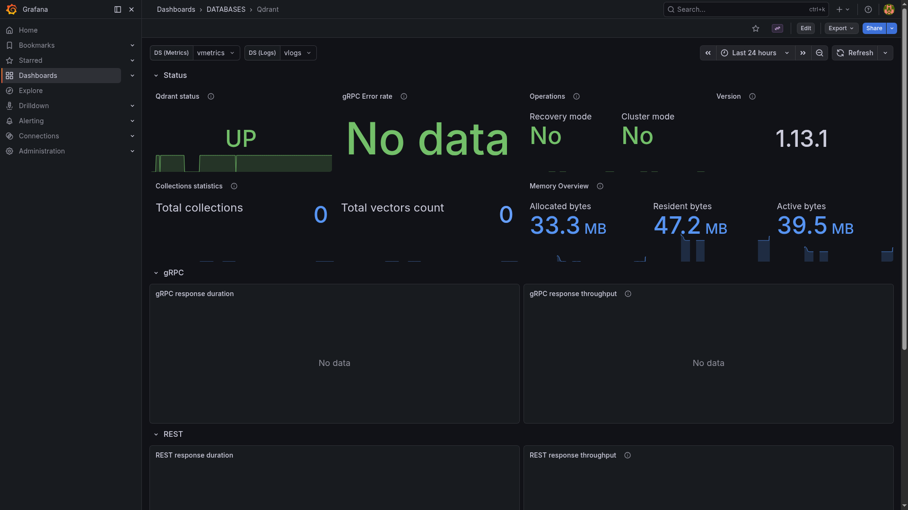

# Qdrant

> High-performance vector similarity search engine for long-term memory and RAG backing store.

## Dashboard



## Grafana metrics



## Ports

| Host | Purpose |
|------|---------|
| 26000 | REST API + web dashboard (`/dashboard`) |
| 26001 | gRPC API |

## Quick start

```bash
./yai.sh start qdrant
# Dashboard: http://localhost:26000/dashboard
# REST API:  http://localhost:26000
```

## Docs

- Qdrant docs: <https://qdrant.tech/documentation/>
- Releases: <https://github.com/qdrant/qdrant/releases>
