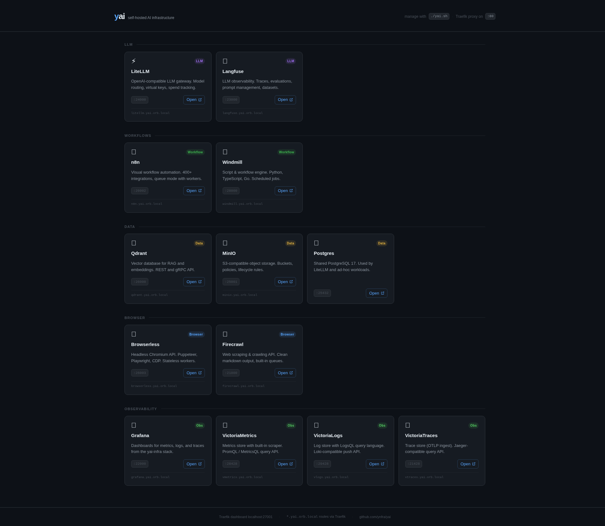
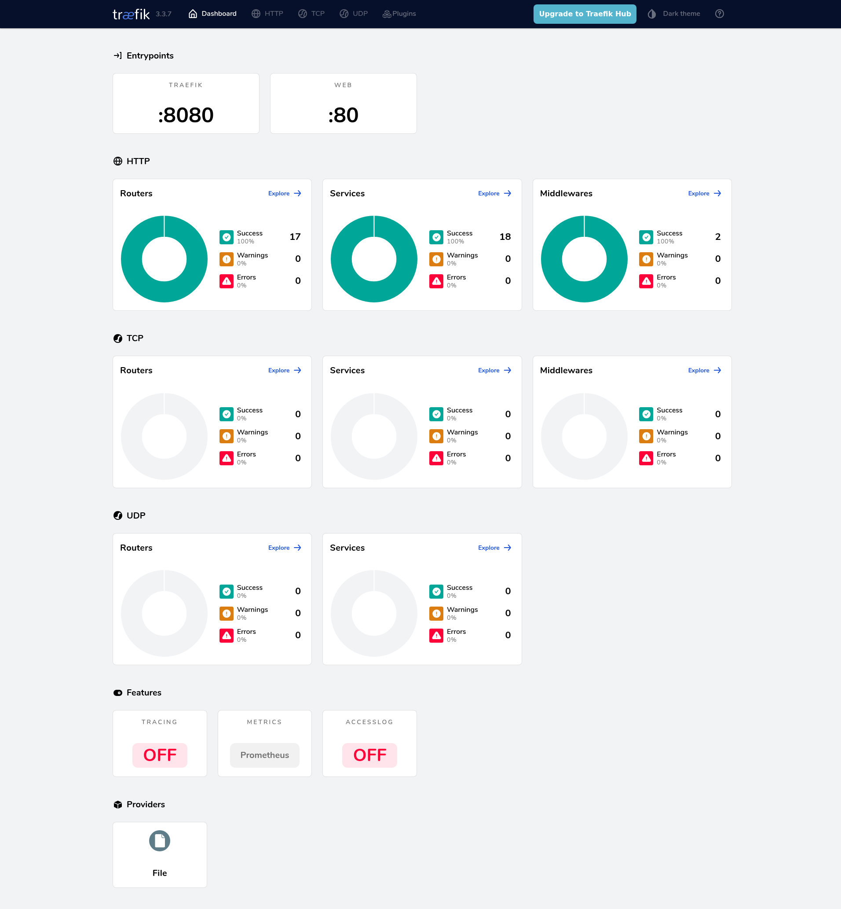
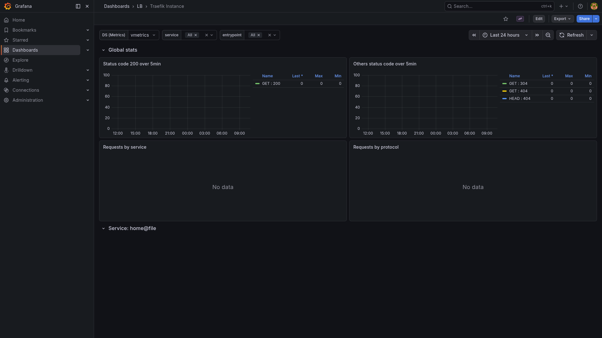

# Traefik

> HTTP reverse proxy and navigation dashboard routing `*.localhost` subdomains to every yai service.

## Navigation dashboard



## API / routing dashboard



## Grafana metrics



## Ports

| Host | Purpose |
|------|---------|
| 80 | HTTP entrypoint — `<service>.localhost` routing |
| 27001 | Traefik API / routing dashboard |

## Quick start

```bash
./yai.sh start traefik
```

Once running every service is reachable at `http://<service>.localhost` and the
navigation page is at `http://localhost`.

## Docs

- Traefik docs: <https://doc.traefik.io/traefik/>
- Releases: <https://github.com/traefik/traefik/releases>
