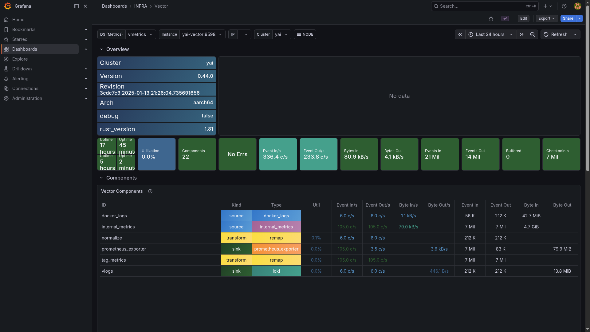

# Vector

> Docker log collector — tails all `yai-*` container logs and ships them to VictoriaLogs via the Loki-compatible push API.

## Grafana metrics



## Ports

Vector has no host-exposed port. It scrapes Docker logs internally and exposes Prometheus metrics on `:9598` (scraped by VictoriaMetrics on the `yai-infra` network).

## Quick start

```bash
./yai.sh start vector
```

Vector starts automatically collecting logs from all running `yai-*` containers.
Configuration: `vector/vector.yaml`.

## Docs

- Vector docs: <https://vector.dev/docs/>
- Releases: <https://github.com/vectordotdev/vector/releases>
