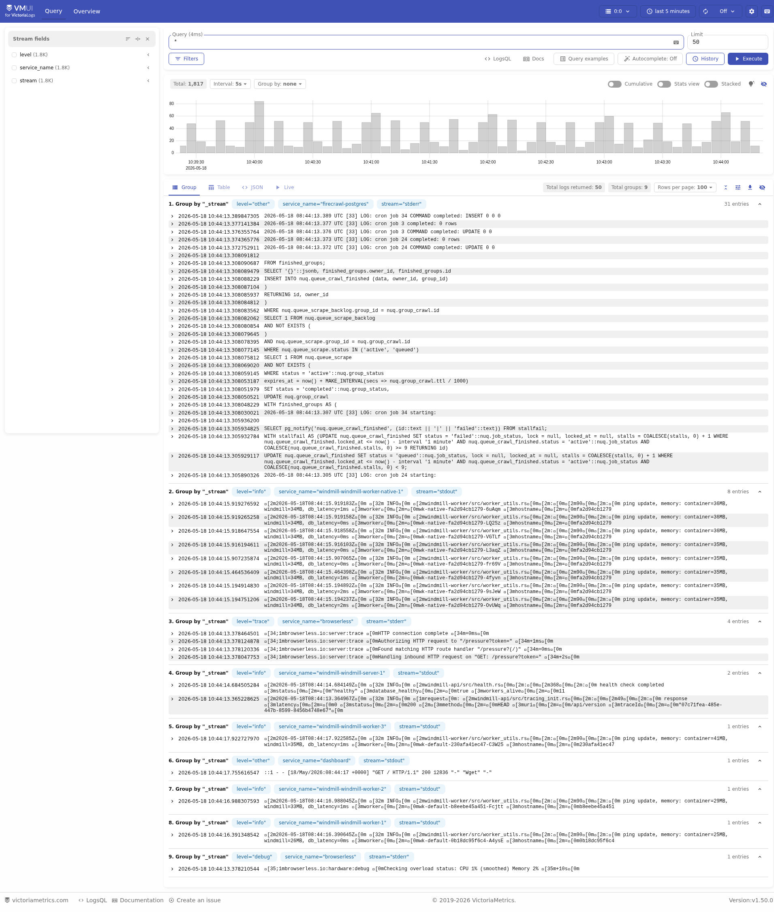
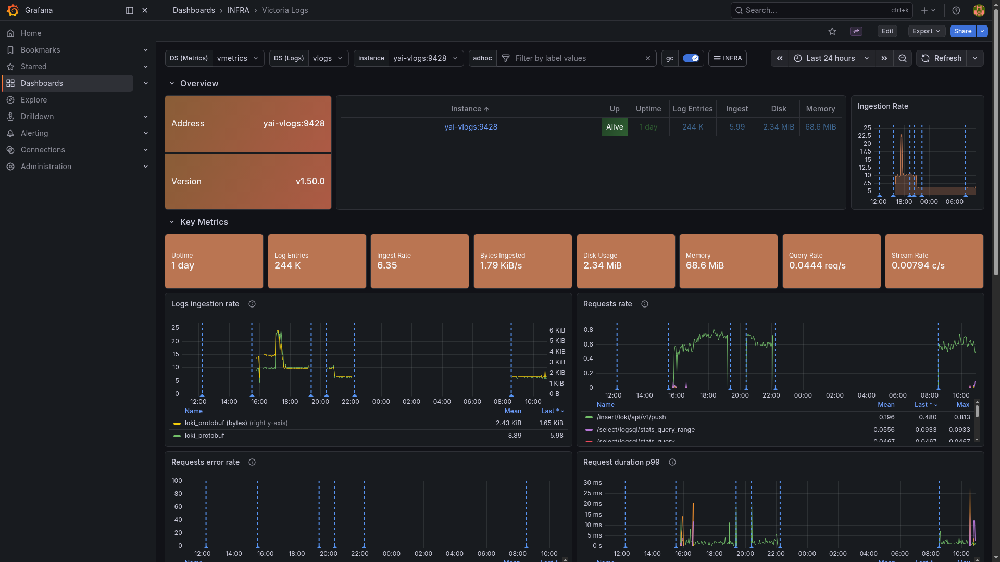

# VictoriaLogs

> High-performance log store with a Loki-compatible push API and LogsQL query interface.

## VMUI



## Grafana dashboard



## Ports

| Host | Purpose |
|------|---------|
| 29428 | HTTP API: Loki-compatible push, LogsQL query, VMUI at `/select/vmui/` |

## Quick start

```bash
./yai.sh start vlogs
# VMUI: http://localhost:29428/select/vmui/
```

Push endpoint (Loki-compatible): `http://host.docker.internal:29428/insert/loki/api/v1/push`

The `vector` service tails all `yai-*` container logs and ships them here automatically.

## Docs

- VictoriaLogs docs: <https://docs.victoriametrics.com/victorialogs/>
- Releases: <https://github.com/VictoriaMetrics/VictoriaMetrics/releases>
