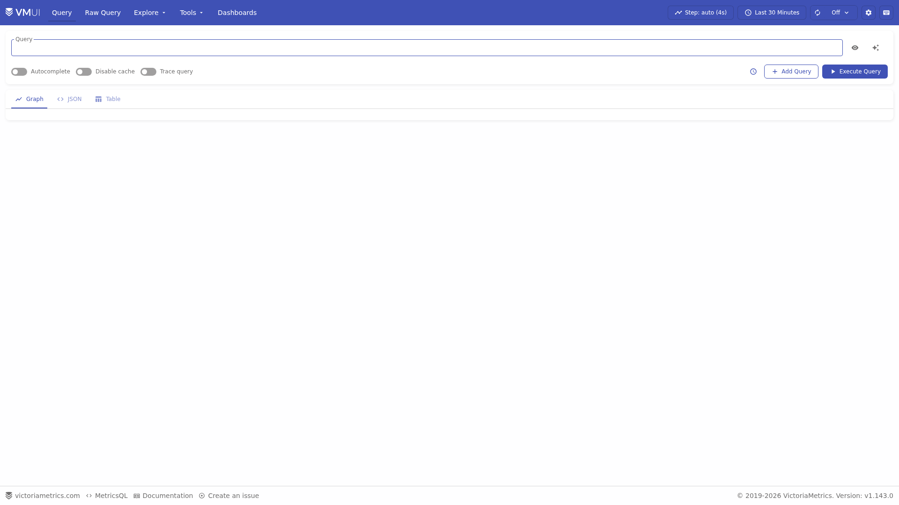
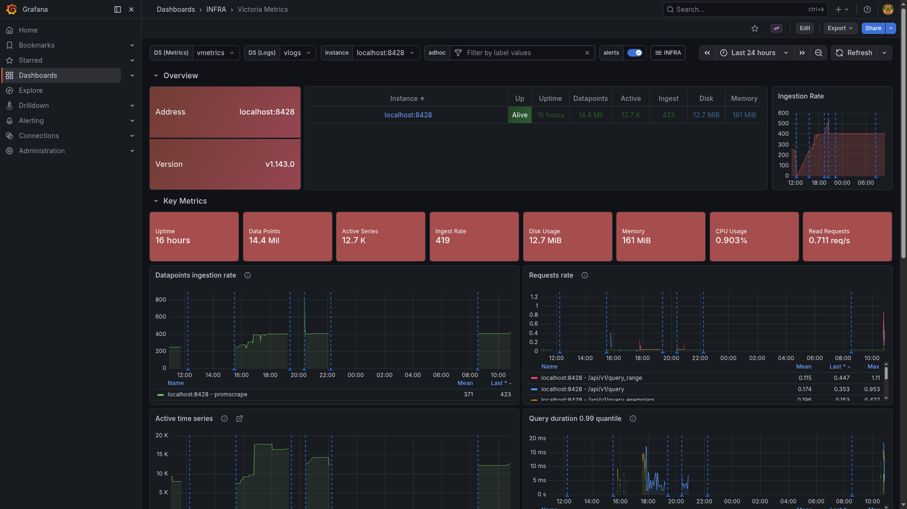

# VictoriaMetrics

> Single-node metrics store with a built-in Prometheus-compatible scraper and MetricsQL query interface.

## VMUI



## Grafana dashboard



## Ports

| Host | Purpose |
|------|---------|
| 28428 | HTTP API: remote_write, PromQL/MetricsQL query, `/targets`, VMUI at `/vmui/` |

## Quick start

```bash
./yai.sh start vmetrics
# VMUI:    http://localhost:28428/vmui/
# Targets: http://localhost:28428/targets
```

Scrape targets are configured in `vmetrics/promscrape.yml`.
Remote-write endpoint for other collectors: `http://host.docker.internal:28428/api/v1/write`.

## Docs

- VictoriaMetrics docs: <https://docs.victoriametrics.com/victoriametrics/>
- Releases: <https://github.com/VictoriaMetrics/VictoriaMetrics/releases>
