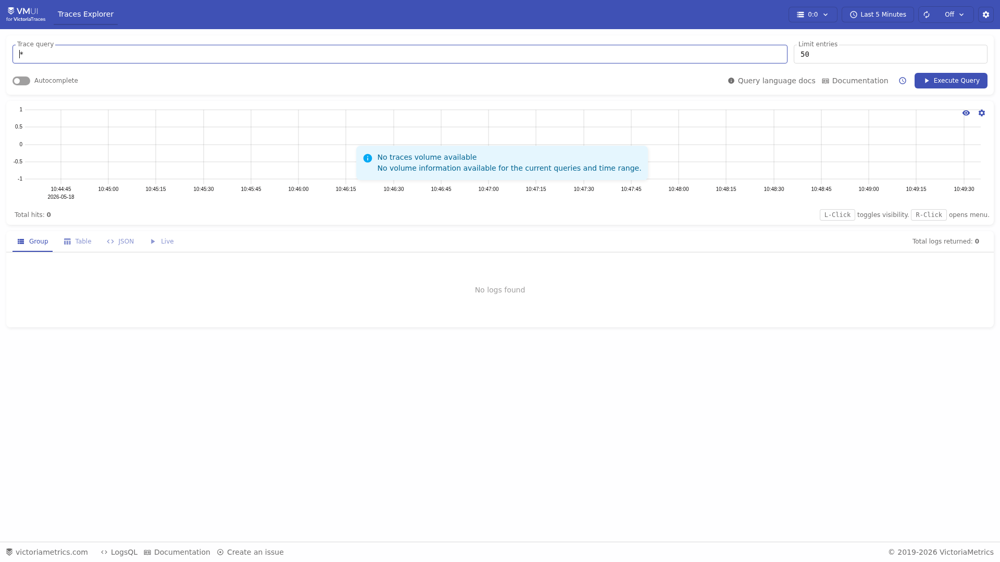
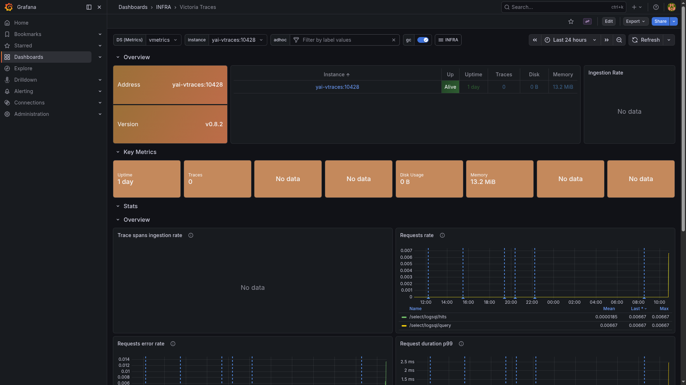

# VictoriaTraces

> Distributed trace store with OTLP ingest and a Jaeger-compatible query UI.

## Traces Explorer UI



## Grafana dashboard



## Ports

| Host | Purpose |
|------|---------|
| 21428 | OTLP ingest + Jaeger-compatible query + Jaeger UI at `/select/jaeger/search` |

## Quick start

```bash
./yai.sh start vtraces
# Traces Explorer UI: http://localhost:21428/select/vmui/
```

OTLP ingest endpoint: `http://host.docker.internal:21428/insert/opentelemetry/v1/traces`

Wire LiteLLM and Langfuse OTLP exporters to this endpoint to capture LLM call traces.

## Docs

- VictoriaTraces docs: <https://docs.victoriametrics.com/victoriatraces/>
- Releases: <https://github.com/VictoriaMetrics/VictoriaMetrics/releases>
