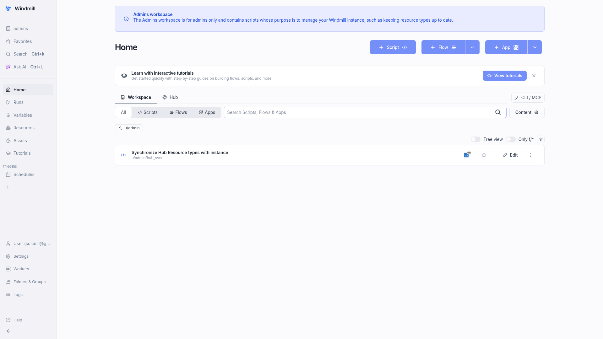

# Windmill

> Developer platform for internal tools and workflows in TypeScript, Python, Go, Bash, SQL, or PHP.

## UI



## Ports

| Host | Purpose |
|------|---------|
| 28000 | Web UI, REST API, webhooks |

## Quick start

```bash
# Set POSTGRES_PASSWORD in windmill/.env
./yai.sh start windmill
# Open http://localhost:28000
```

Three standard workers and one native worker run alongside the server container.
Point scripts at the LiteLLM gateway via `http://host.docker.internal:24000/v1`.

## Docs

- Windmill docs: <https://www.windmill.dev/docs/intro>
- Releases: <https://github.com/windmill-labs/windmill/releases>
